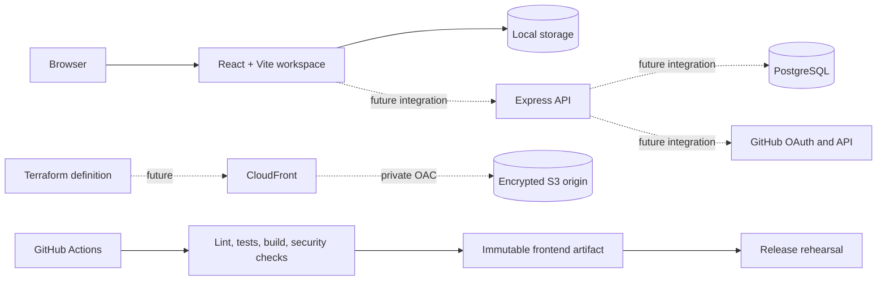

<p align="center">
  
</p>

<h1 align="center">Pomogit</h1>

<p align="center">
  A local-first visual workspace for turning visible work into finished outcomes.
</p>

<p align="center">
  <a href="https://github.com/zacknguyn/pomodoro-timer/actions/workflows/ci.yml"></a>
  
  
</p>

Pomogit connects planning, focused execution, and evidence of progress in one calm workspace. Capture work on a board, arrange ideas on a canvas, protect one task with a focus timer, then close the loop with a commit, pull request, or written result.

> [!IMPORTANT]
> Pomogit is currently local-first and is not hosted. The AWS infrastructure is defined as code for review, while the delivery workflow performs a release rehearsal without credentials or cloud mutations.

## The workflow

```text
Choose an outcome  ->  Focus on one thing  ->  Record proof  ->  Review the worklog
```

| Surface | Purpose |
| --- | --- |
| Home | Summarize active, upcoming, and recently completed work. |
| Board | Move tasks through Inbox, Ready, Focus, and Done. |
| Canvas | Arrange task pins, notes, and freehand thinking spatially. |
| Focus | Run a protected session against one explicit outcome. |
| Worklog | Review duration, evidence, and notes from completed sessions. |

The active workspace is stored in the browser. No account or backend connection is required for the current product experience.

## Architecture



### Current delivery boundary

| Layer | State |
| --- | --- |
| Frontend | Runs locally and is covered by lint, tests, and production builds. |
| Browser storage | Active; workspace data remains on the user's device. |
| Backend | Retained for the future authenticated product; not part of deployment. |
| Terraform | Defines a private S3 and CloudFront architecture; not applied. |
| CI | Active on pull requests and `main`. |
| CD | Rehearsal only: packages, verifies, checksums, and republishes the build artifact. |

## Technology

- React 19 and Vite 7
- Tailwind CSS 4 with project-level interface styles
- Motion and Lucide icons
- Node.js test runner and ESLint
- Express and PostgreSQL for the future authenticated API
- Terraform with the AWS provider
- GitHub Actions and Dependabot

## Run locally

Requirements: Node.js 22.12 or newer and npm.

```bash
git clone https://github.com/zacknguyn/pomodoro-timer.git
cd pomodoro-timer/frontend
npm ci
npm run dev
```

Vite prints the local URL after startup. Workspace data is saved in browser storage, can be exported through Settings, and can be cleared through browser developer tools.

## Verify the application

```bash
cd frontend
npm run lint
npm test
npm run build
```

The backend currently exposes a syntax-safety check:

```bash
cd backend
npm ci
npm run check
```

## Infrastructure definition

The configuration in [`terraform/`](./terraform) describes the intended static frontend edge:

- globally unique, encrypted, versioned S3 origin;
- all S3 public-access controls enabled;
- CloudFront Origin Access Control with signed requests;
- HTTPS redirect, compression, SPA route fallback, and browser security headers;
- conservative deletion defaults and short-lived noncurrent build versions.

Static validation does not require an AWS deployment:

```bash
cd terraform
terraform fmt -check -recursive
terraform init -backend=false
terraform validate
```

There is intentionally no remote state backend, deploy role, AWS credential, `terraform plan`, or `terraform apply` in the repository yet.

## CI/CD rehearsal

The [`CI` workflow](./.github/workflows/ci.yml) models a build-once delivery path:

1. Scan tracked files for common credential formats.
2. Audit, lint, test, and build the frontend.
3. Audit and syntax-check the backend.
4. Format-check and validate Terraform without a state backend.
5. Upload the tested frontend as a commit-addressed artifact.
6. On `main` or a manual run, download that exact artifact and generate `SHA256SUMS`.
7. Publish a deployment-rehearsal summary and retain the bundle for seven days.

The workflow has read-only repository permissions and deliberately receives no AWS credentials. Enabling deployment later will require a separately reviewed GitHub OIDC role and environment approval.

## Repository layout

```text
.
├── frontend/              # Current local-first React application
├── backend/               # Future authenticated API and Lambda adapters
├── terraform/             # Review-only AWS infrastructure definition
└── .github/
    ├── workflows/ci.yml   # CI and release rehearsal
    └── dependabot.yml     # Dependency maintenance
```

## Roadmap

- Refine the board and canvas interaction model.
- Add workspace import and strengthen export recovery.
- Complete the backend authentication and storage security review.
- Bootstrap remote Terraform state.
- Add short-lived GitHub OIDC deployment credentials.
- Promote the rehearsed artifact to S3 and invalidate CloudFront.

## Security

Do not commit `.env`, `*.tfvars`, Terraform state, access keys, OAuth secrets, or database credentials. Use the checked-in `.env.example` and `terraform.tfvars.example` files only as schemas.

Potential security issues should be reported privately to the repository owner rather than opened as public exploit reports.
