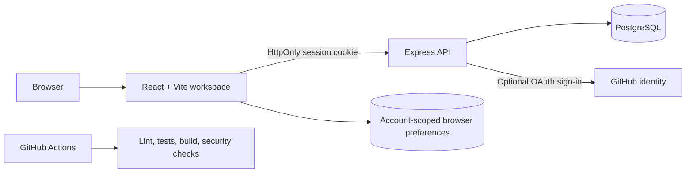

<p align="center">
  
</p>

<h1 align="center">Pomogit</h1>

<p align="center">
  A developer workspace for turning visible work into finished outcomes.
</p>

<p align="center">
  <a href="https://github.com/zacknguyn/pomodoro-timer/actions/workflows/ci.yml"></a>
  
  
</p>

Pomogit connects planning, focused execution, and evidence of progress in one calm workspace. Capture a task, organize it on the board, focus on it, then mark it done and optionally leave a note or reference link.

> [!IMPORTANT]
> Pomogit runs locally with email accounts and PostgreSQL-backed workspaces and is not hosted. GitHub sign-in requires configuring an OAuth App; public repository connection and selected issue import are available. Private repository access and password recovery are not connected. The AWS infrastructure is defined as code for review. CI checks changes without deploying; deployment remains a separate manual step.

## The workflow

```text
Capture in Inbox  ->  Organize in Ready  ->  Focus in In progress  ->  Done + optional note
```

| Surface | Purpose |
| --- | --- |
| Workspace | Pick a task, keep its next step close, and run the floating timer. |
| Board | Organize tasks through Inbox, Ready, In progress, and Done. |
| Activity | Review notes and task changes. |
| Profile | Customize a browser-local identity and preview selected work. |

Tasks, projects, next steps, notes, and focus sessions belong to the signed-in account and persist in PostgreSQL. Appearance and profile preferences stay in this browser, separately for each account. Existing mock tasks are kept locally and are not automatically imported into an account.

Delete a task from its popup or the trash button beside Edit in Workspace. Confirmation permanently removes the task, its notes, and its focus history. Stop its active or paused timer first. Linked GitHub issues and pull requests are unaffected.

## Architecture


```mermaid
flowchart LR
    User[Browser] --> App[React + Vite workspace]
    App -->|HttpOnly session cookie| API[Express API]
    API --> Postgres[(PostgreSQL)]
    App --> Preferences[(Account-scoped browser preferences)]
    Actions[GitHub Actions] --> Checks[Lint, tests, build, security checks]
    API -->|Optional OAuth sign-in| GitHub[GitHub identity]
```

Production builds always use real accounts and the API. An explicit development preview can still run without the backend. Deployment remains manual; this milestone does not provision or deploy AWS resources.

## Technology

- React 19 and Vite 7
- Tailwind CSS 4 with project-level interface styles
- Lucide icons and Dither avatars
- Node.js test runner and ESLint
- Express and PostgreSQL with Argon2 password hashes and opaque server-side sessions
- Terraform with the AWS provider
- GitHub Actions and Dependabot

## Run locally

Requirements: Node.js 22.12 or newer, npm, and PostgreSQL 16 (or Docker Compose).

From the repository root, prepare the backend:

```bash
cd backend
npm ci
cp .env.example .env
```

Replace `change-me` in both `POSTGRES_PASSWORD` and `DATABASE_URL` in the untracked `.env`. Keep `DATABASE_SSL=false` for the local database, `DEV_BYPASS_AUTH=false`, and `FRONTEND_URL=http://localhost:5173` for the default Vite origin. If you use `127.0.0.1` or another port, update the frontend origin to match exactly.

```bash
docker compose up -d --wait db
npm run db:init       # New database only.
# Existing initialized database: npm run db:workspace
npm run dev
```

The Compose database binds to loopback and uses a persistent named volume. `docker compose down` retains data; `down -v` deletes it. The workspace migration adds fields and the In progress status without deleting existing records.

In another terminal:

```bash
cd frontend
npm ci
npm run dev
```

Leave `VITE_API_URL` unset or set it to `/api`; Vite proxies API requests to the local backend on port 3000. Register with email and a password of at least 12 characters. Tasks and timers remain available after logout and login from another browser using the same backend. Logging out revokes that browser's login session and leaves the focus timer saved.

For standalone UI work only:

```bash
cd frontend
VITE_DEV_BYPASS_AUTH=true npm run dev
```

This flag uses browser-local sample data only in the development server. It cannot bypass authentication in a production build.

## Enable GitHub sign-in locally

Create an OAuth App at [GitHub developer settings](https://github.com/settings/developers). Use your exact frontend origin as the Homepage URL and append `/api/auth/github/callback` for the Authorization callback URL. For the running app at `http://127.0.0.1:5173`, use `http://127.0.0.1:5173/api/auth/github/callback`.

Set `GITHUB_CLIENT_ID`, `GITHUB_CLIENT_SECRET`, and `GITHUB_CALLBACK_URL` in the private `backend/.env`, then run `npm run db:github` in `backend` for an existing database and restart the backend. New databases initialized with `db:init` already include the GitHub schema. Never commit `.env` or place the secret in a frontend `VITE_` variable.

Continue with GitHub requests only identity/email access, uses state and PKCE, and creates a normal server-side Pomogit session. Provider tokens are not stored. Existing email accounts are not automatically linked by matching email; continue using email login for those accounts until explicit account linking is available. From Workspace or Board, choose **Connect GitHub repository**. Pick one of your public repositories or paste a GitHub repository URL. The connection creates an account-owned project filter even before importing any issues. Select up to 20 open issues and import them into Inbox. Pull requests are excluded; importing an issue twice does not create another task, even if you edit its reference. Imports are copies, not synchronization, and never modify GitHub.

Pasting a repository URL into task capture saves a readable `owner/repository` task with a reference link; it does not connect the repository. The task editor’s Project name is a label, not a URL field.

For an existing database, run `npm run db:projects` in `backend`. Public repository browsing does not retain OAuth tokens or request private access. GitHub public API limits are shared by server IP; the app reports rate limits rather than showing an empty list. Private repositories will require a separate GitHub App integration.

## Verify the application

```bash
cd frontend
npm run lint && npm test && npm run build
cd ../backend
npm run check && npm test
cd ..
git diff --check
```

The database integration test is opt-in and accepts only a database name ending in `_test` or `_verification`. Initialize a disposable database with the current schema, then run:

```bash
cd backend
POMOGIT_TEST_DATABASE_URL=postgresql://postgres@127.0.0.1:55432/pomogit_verification npm test
```

It checks real registration/login, cookie revocation and expiration, account isolation, task fields/notes, timer transitions, and export. Without this variable, the integration test is explicitly skipped.

For the production browser flow, run `npm run preview -- --host 127.0.0.1 --port 5181` in `frontend`, point the local backend at the disposable database, and set its `FRONTEND_URL=http://127.0.0.1:5181`. With an existing Playwright installation:

```bash
POMOGIT_PLAYWRIGHT_MODULE=/path/to/playwright node design/verification/check_connected_workspace.mjs
```

Optional `POMOGIT_CHROMIUM` selects an existing Chromium binary. The audit uses isolated desktop and mobile contexts and creates test accounts in the disposable database. It verifies saved context across browsers, actual login/logout, errors, focus, completion, and export. Firefox can run the account/timer checks with `python design/verification/check_connected_firefox.py --output /tmp/pomogit-connected-firefox`. Mobile checks use browser emulation, not a physical phone. Earlier UI-only audits expect mock data and should be used with the explicit development preview.

## Infrastructure definition

The configuration in [`terraform/`](./terraform) describes the intended static frontend edge:

- globally unique, encrypted, versioned S3 origin;
- all S3 public-access controls enabled;
- CloudFront Origin Access Control with signed requests;
- HTTPS redirect, compression, SPA route fallback, and browser security headers;
- conservative deletion defaults and short-lived noncurrent build versions.

Static validation does not require an AWS deployment:

```bash
cd terraform
terraform fmt -check -recursive
terraform init -backend=false
terraform validate
```

There is intentionally no remote state backend, deploy role, AWS credential, `terraform plan`, or `terraform apply` in the repository yet.

## Solo development and CI

Direct commits to `main` are supported; pull requests are optional. The [`CI` workflow](./.github/workflows/ci.yml) runs on every push to `main`, on pull requests when used, and on manual runs:

1. Scan tracked files for common credential formats.
2. Audit, lint, test, and build the frontend.
3. Audit and syntax-check the backend.

CI has read-only repository permissions. It does not validate Terraform, upload release artifacts, rehearse a release, or deploy. Deployment remains manual and must be configured separately when hosting is introduced.

GitHub CodeQL default setup scans Actions and JavaScript/TypeScript on the default branch and on pull requests targeting it.

## Repository layout

```text
.
├── frontend/              # React workspace and account UI
├── backend/               # Authenticated PostgreSQL API and Lambda adapters
├── terraform/             # Review-only AWS infrastructure definition
└── .github/
    ├── workflows/ci.yml   # Frontend checks and security audits
    └── dependabot.yml     # Dependency maintenance
```

## Roadmap

- GitHub sign-in, repository selection, and selected issue import into Inbox.
- Password recovery with a configured email service.
- Account-backed profile and appearance preferences.
- Hosting and deployment as a separate approved milestone.

## Security

Do not commit `.env`, `*.tfvars`, Terraform state, access keys, OAuth secrets, or database credentials. Use the checked-in `.env.example` and `terraform.tfvars.example` files only as schemas.

Potential security issues should be reported privately to the repository owner rather than opened as public exploit reports.

Remove a project from **Connect GitHub repository → Your projects** using its trash button. Confirming clears that project label from your tasks and disconnects its repository. Tasks, notes, reference links, active timers, and import identity remain intact; reconnecting does not duplicate previously imported issues. Local project labels can be removed from the same list.
